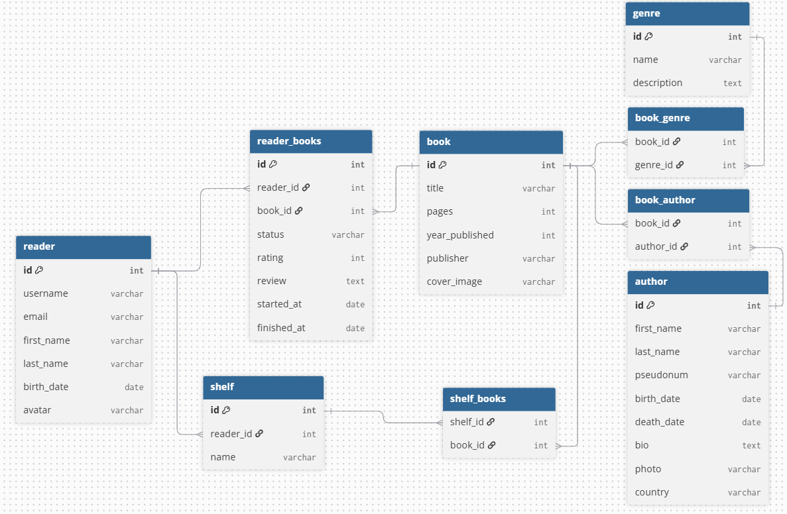

# Digital Library

A book-tracking website built with Django. Readers can browse books, rate and
review what they've read, organize their personal library into shelves, and
discover new titles through the highest-rated picks on the home page.

Built as a portfolio project for Mate Academy.

## Features

- Browse books, authors, and genres with search and pagination
- Rate books (1–10) and leave reviews
- Organize books into personal shelves (default shelves are created
  automatically on registration; custom shelves can be added)
- Average rating shown with a star-rating display, plus recent reviews
  on each book's page
- Author pages show a black-and-white photo for authors who have passed away
- Any logged-in reader can add new books and authors; only staff can edit or
  delete existing records
- User registration and profile editing
- Django admin configured for all models, with search and filtering
  (including a custom "is alive" filter for authors)

## Tech stack

- Python, Django
- SQLite (default)
- Bootstrap 4
- Pillow (for image fields)

## Project structure

- `core/` — Django project settings
- `digital_library/` — main app: models, views, forms, templates, static files

## Database schema



## Setup

1. Clone the repository and create a virtual environment:
   ```bash
   git clone https://github.com/FedirKiiko/digital-library.git
   cd digital-library
   python -m venv venv
   source venv/bin/activate  # venv\Scripts\activate on Windows
   ```

2. Install dependencies:
   ```bash
   pip install -r requirements.txt
   ```

3. Apply migrations:
   ```bash
   python manage.py migrate
   ```

4. (Optional) Load sample data:
   ```bash
   python manage.py loaddata fixture.json
   ```
   All seeded readers use the password `password123`. User `admin` is a
   superuser with staff access.

5. Run the development server:
   ```bash
   python manage.py runserver
   ```

6. Visit `http://127.0.0.1:8000/` in your browser.

## Models

- **Reader** — custom user model (`AbstractUser`), with `birth_date` and `avatar`
- **Author** — `first_name`, `last_name`, `pseudonym`, `birth_date`,
  `death_date`, `bio`, `photo`, `country`; `is_alive` is a computed property
- **Genre** — `name`, `description`
- **Book** — `title`, `pages`, `year_published`, `publisher`, `cover_image`;
  many-to-many with `Author` and `Genre`
- **Shelf** — a reader's custom book collection (many-to-many with `Book`)
- **ReaderBook** — one record per reader/book pair, holding `status`,
  `rating`, and `review`

## License

This project was built for educational purposes as part of the Mate Academy
Python course.
